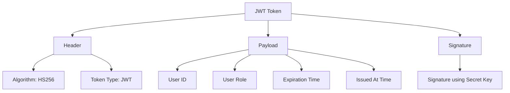
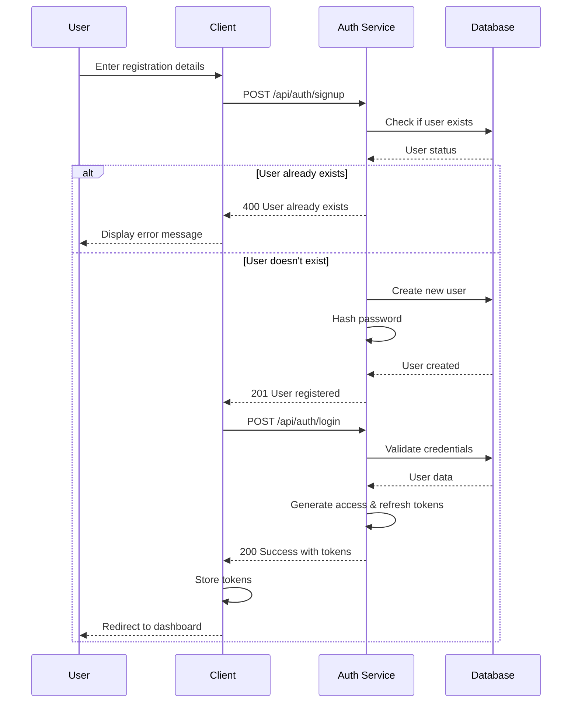
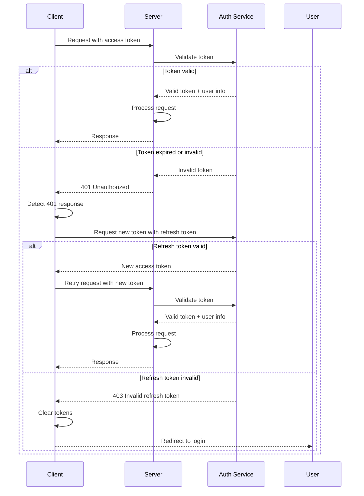
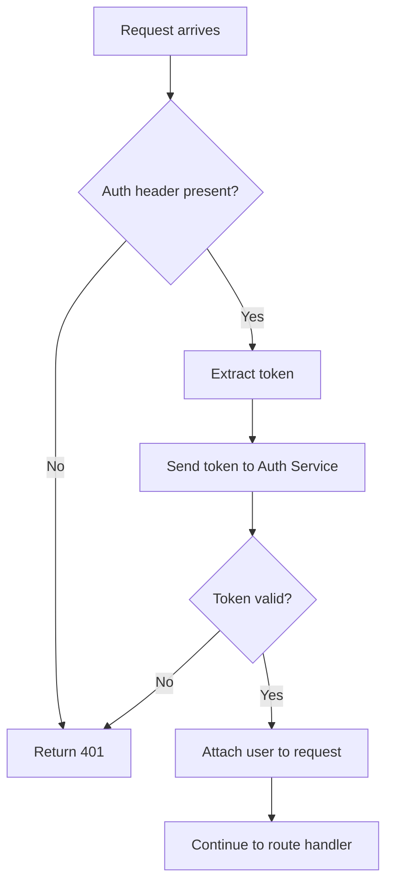
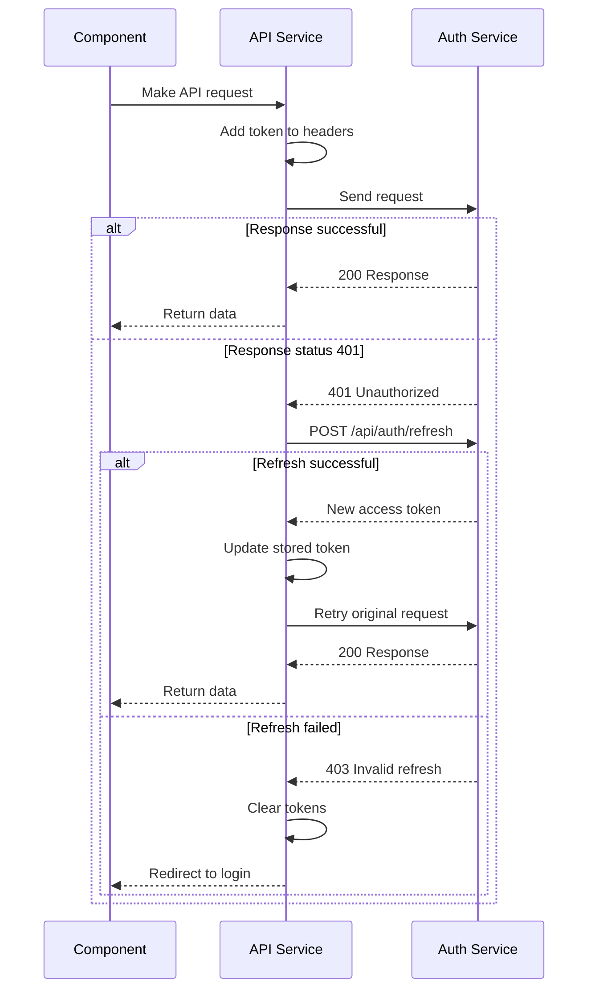

# How the Authentication Works in Flashcard Web Application

This document explains the authentication workflows for all server endpoints in the Flashcard Web Application. It's designed for newcomers to understand how the authentication system works, the JWT token flow, and how the external authentication system integrates with the main application.

## Table of Contents

1. [Authentication Overview](#authentication-overview)
2. [JWT Token Design](#jwt-token-design)
3. [Authentication Workflow](#authentication-workflow)
4. [Authentication Middleware](#authentication-middleware)
5. [Endpoint Authentication Types](#endpoint-authentication-types)
6. [Client-Side Authentication Flow](#client-side-authentication-flow)
7. [Server-Side Authentication Flow](#server-side-authentication-flow)
8. [JWT Design Considerations](#jwt-design-considerations)

## Authentication Overview

The Flashcard Web Application uses JSON Web Tokens (JWT) for authentication. It implements a two-token authentication system:

- **Access Token**: Short-lived token (15 minutes by default) used to access protected resources
- **Refresh Token**: Long-lived token (7 days by default) used to obtain new access tokens when they expire

Authentication is handled by a separate authentication service (currently mocked in development using the mock server in `docker/auth-mock`), which is responsible for user management, token generation, and validation.

## JWT Token Design



Access tokens contain the following claims:

- `id`: The user's unique identifier
- `role`: The user's role (admin, supervisor, or enduser)
- `exp`: Expiration time (15 minutes from issuance)
- `iat`: Time the token was issued

Refresh tokens contain:

- `id`: The user's unique identifier
- `exp`: Expiration time (7 days from issuance)
- `iat`: Time the token was issued

## Authentication Workflow

### Registration and Login Flow



### Token Validation and Refresh Flow



## Authentication Middleware

The authentication middleware (`authenticateJwt`) in `server/src/middleware/auth.middleware.ts` handles token validation for protected routes. The middleware:

1. Extracts the JWT token from the Authorization header
2. Validates the token with the authentication service
3. If valid, attaches the user information to the request object
4. If invalid, returns a 401 Unauthorized response



For admin-only routes, an additional middleware (`requireAdmin`) checks if the authenticated user has the admin role.

## Endpoint Authentication Types

The application has three types of endpoints:

1. **Public Endpoints**: No authentication required
   - Health check endpoint (`/health`)
   - Authentication endpoints (login, register, etc.)

2. **Protected Endpoints**: Require user authentication
   - All deck endpoints (`/api/decks/*`)
   - All card endpoints (`/api/cards/*`)
   - Credit balance and transactions (`/api/credits/*`)

3. **Admin-Only Endpoints**: Require admin role
   - User management (`/api/admin/users/*`)
   - Credit package management (`/api/admin/packages/*`)
   - Credit transaction history (`/api/admin/transactions`)

### Route Protection Implementation

All route files use middleware to protect endpoints:

```javascript
// All deck routes require authentication
router.use(authenticateJwt);

// Routes defined here...
```

Admin routes use additional middleware:

```javascript
// All admin routes require authentication and admin privileges
router.use(authenticateJwt);
router.use(requireAdmin);

// Admin routes defined here...
```

## Client-Side Authentication Flow

### Storing Tokens

The client stores the authentication tokens in localStorage:

- `flashcard_token`: The access token
- `flashcard_refresh_token`: The refresh token

### Token Management

The client handles token management through the AuthContext provider (`client/src/contexts/AuthContext.tsx`), which:

1. Initializes by checking for existing tokens in localStorage
2. Provides login/logout functions
3. Checks token validity on initialization
4. Maintains authentication state across the application

### API Request Interceptors

The API service (`client/src/services/api.js`) uses Axios interceptors to:

1. Add the access token to all outgoing requests
2. Handle 401 responses by attempting to refresh the token
3. Retry failed requests with the new token
4. Redirect to login if the refresh fails



## Server-Side Authentication Flow

### Integration with External Auth Service

The server communicates with the external authentication service to validate tokens. This is done in the `authenticateJwt` middleware:

```typescript
// Validate token with auth service
try {
  const response = await axios.post(`${AUTH_API_URL}/api/auth/validate-token`, { token });
  
  if (response.data && response.data.valid) {
    // Store user info from the token in the request object
    req.user = response.data.user;
    next();
  } else {
    return res.status(401).json({ message: 'Invalid token' });
  }
} catch (error) {
  return res.status(401).json({ message: 'Token validation failed' });
}
```

### Mock Auth Server Implementation

In development, the authentication service is mocked by a simple Express server (`docker/auth-mock/server.js`), which:

1. Provides authentication endpoints (signup, login, etc.)
2. Handles token generation and validation
3. Creates default test users (admin and regular user)

## JWT Design Considerations

### Current Implementation

The current JWT implementation:

1. Uses separate access and refresh tokens
2. Includes minimal user information in the token
3. Has configurable expiration times
4. Uses HMAC-SHA256 (HS256) for token signing

### Recommendations for Improvement

Based on analysis of the current implementation, here are some recommendations for improvement:

1. **Token Payload**
   - Currently good, containing only necessary user information (ID and role)
   - Consider adding a unique token ID (jti) to support token revocation

2. **Token Storage**
   - Access token stored in localStorage (security risk for XSS attacks)
   - Consider using httpOnly cookies for refresh tokens
   - Access tokens could be kept in memory only

3. **Token Expiration**
   - Current default of 15 minutes for access tokens and 7 days for refresh tokens is reasonable
   - Consider shorter access token expiration (5-10 minutes) for more sensitive operations

4. **Token Rotation**
   - Implement refresh token rotation (issue a new refresh token with each refresh)
   - This mitigates the risk of leaked refresh tokens

5. **Token Revocation**
   - Implement a token blacklist for immediate revocation when needed
   - Use Redis or similar for efficient blacklist implementation

6. **Additional Security Measures**
   - Add fingerprinting (device/browser information) to refresh tokens
   - Implement rate limiting for token refresh attempts
   - Consider adding audience (aud) and issuer (iss) claims

### Integration with External Auth System

The current design using a separate authentication service is good for:

1. **Separation of concerns**: Authentication logic is decoupled from the main application
2. **Reusability**: The same auth service can be used by multiple applications
3. **Security**: Authentication logic can be isolated in a more secure environment

To improve the integration:

1. Implement a proper validation endpoint in the auth service
2. Use standardized token validation (OAuth 2.0 / OpenID Connect principles)
3. Consider implementing introspection endpoint for token validation
4. Cache validation results to reduce external service calls

## Conclusion

The current JWT authentication implementation provides a solid foundation for securing the Flashcard Web Application. The two-token system with refresh capability offers a good balance between security and user experience.

By implementing the recommendations above, especially regarding token storage, rotation, and revocation, the system could be further strengthened against various security threats while maintaining its current functionality.
